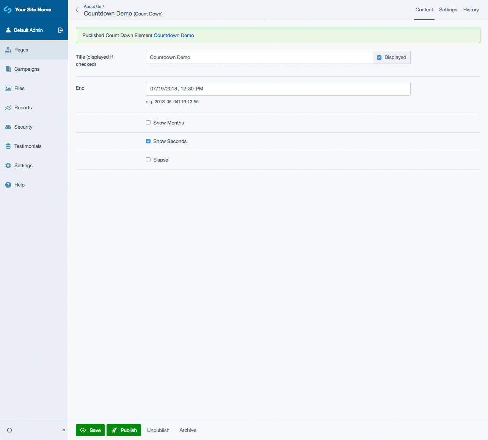

# SilverStripe Elemental Countdown Block

Displays a countdown to a specific date and time.

## Requirements

* silverstripe/recipe-cms: ^4@dev
* dnadesign/silverstripe-elemental: ^4@dev

## Installation

`composer require dynamic/silverstripe-elemental-countdown`

## Usage

Elemental Countdown Block will add the following Element to your site:

* Countdown (to a date/time specified in the cms)

### Template Notes

When overriding the `templates/Dynamic/Elements/CountDown/Elements/ElementCountDown.ss` file in your own theme, be sure to include the following in your `.countdown` element:

* `data-end="$End $Timezone"`
* `data-elapse="$Elapse"`

example: `

`

The above is used in the initialization of the countdown plugin.

## Screen Shots

#### Front End sample of a Countdown Element

#### CMS - Countdown Element Main Tab

## Getting more elements

See [Elemental modules by Dynamic](https://github.com/dynamic/silverstripe-elemental-blocks#getting-more-elements)

## Configuration

See [SilverStripe Elemental Configuration](https://github.com/dnadesign/silverstripe-elemental#configuration)
